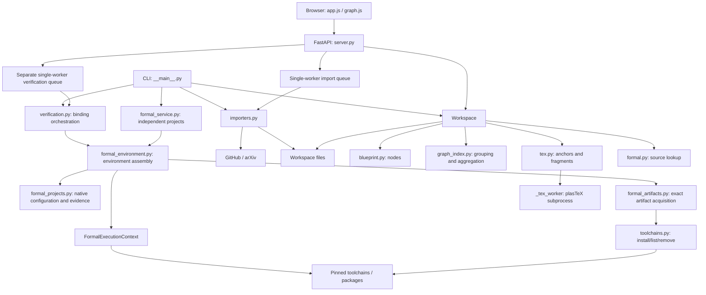

# Qprint architecture

[中文](ARCHITECTURE.md) | [English](ARCHITECTURE.en.md) · [Documentation](docs/index.en.md)

This document covers `0.1.0` and the graph granularity extension. Qprint consists of a local Python service, a browser frontend without a build step, and an ordinary file workspace. It has no database.

## Local Python environment and startup boundary

The Qprint root is the working directory for users and agents. For first-time setup, run `conda init powershell` and then `conda env create -p .\.conda -f environment.yml` in Anaconda Prompt / Miniconda Prompt. The environment file installs Qprint and development dependencies into this installation's `.conda`.

All subsequent entry points use `.\.conda\python.exe`; `conda run -p .\.conda python ...` is equivalent when Conda is available. Startup scripts, release scripts and repository skills do not activate environments, depend on profiles/global PATH, search user installations, or select named environments. Missing environments produce the setup command. Python subprocesses inherit the running local interpreter via `sys.executable`.

Configuration, command examples and agent file locations use paths relative to the Qprint root. Internal filesystem resolution and boundary checks still use dynamically resolved paths without hardcoded installation drives. Releases include `environment.yml` and agent skills but exclude `.conda`; recreate the environment at each new installation location.

## System structure

Formal verification separates project boundaries, native requirements, artifact acquisition, environment assembly, language adapters, process execution and report storage. See [project resolution](docs/formal-resolution.en.md) for responsibilities. `formal_service.py` handles independent projects; `verification.py` retains the Blueprint entry point.

The browser retrieves data through same-origin APIs and renders mathematics using local KaTeX. CLI and HTTP entry points share `Workspace` and importers rather than duplicating business rules.

## Module boundaries

| Code | Responsibility | Detailed documentation |
| --- | --- | --- |
| `blueprint.py` | Node model, metadata, node links, text revision hashes | [Blueprint](docs/blueprint.en.md) |
| `workspace.py`, `paths.py` | Scanning, indexing, diagnostics, path boundaries, saves, caching | [Workspace](docs/workspace.en.md) |
| `graph_index.py`, `static/graph-view.js` | Derived file/project data and granularity/scope/drill-down state | [Graphs](docs/graph.en.md) |
| `tex.py`, `_tex_worker.py` | Anchors, sections, fragments, bounded rendering | [TeX](docs/tex-rendering.en.md) |
| `formal.py` | Declaration lookup and source slices for three languages | [Formal code](docs/formal-code.en.md) |
| `verification.py` | Explicit execution, Lean/Agda adapters, stage results, timeouts, and logs | [Formal verification](docs/formal-verification.en.md) |
| `toolchains.py`, `formal_environment.py`, `release.py` | Versioned installs, requirements, contexts, package isolation, light/full ZIPs | [Toolchains](docs/toolchains.en.md) |
| `server.py` | HTTP contracts, write protection, background jobs | [API](docs/server-api.en.md) |
| `static/app.js`, `graph.js`, HTML/CSS | Page state, reading/editing, SVG layout and interaction | [Frontend](docs/frontend.en.md) |
| `importers.py` | Bounded downloads, archive validation, staged publication, provenance | [Importers](docs/importers.en.md) |
| `__main__.py`, `start.ps1`, `tools/` | Startup, checks, dependency assets, smoke tools | [Development](docs/development.en.md) |

## Data ownership and identifiers

Files on disk are the source of truth. `Workspace` scans `blueprint/**/*.md` and `tex/**/*.tex`, maintaining nodes, edges, paper outlines, diagnostics, grouped graph indexes, and rendering caches in memory. Code files are located when node details are requested.

A node ID is `relative-path-without-.md#heading`. File graph IDs include `.md`; project graph IDs are directory paths, with `.` for the root. Renaming a file or level-one heading changes node IDs. There are no permanent UUIDs, alias migrations, or automatic reference repairs.

The name in `/api/project` refers to the whole workspace; `graph.projects` contains graph groups. Grouping is read-only derived data and is not written into node metadata. Node edges come from `uses` / `inspired_by`; coarse edges come from file references. They serve different purposes.

## Main data flows

**Load and refresh:** scan files → parse nodes and TeX → resolve relations and anchor bindings → establish order within papers → aggregate file/project graphs. Refresh rebuilds everything and clears rendering caches. File watching and incremental indexing are not implemented.

**Read a node:** retrieve the node → safely render Markdown → locate code → render TeX on demand → return previous/next nodes, relations, and backlinks. TeX output is cached per node until refresh.

**Save an edit:** retrieve source and SHA-256 → submit the entire text and original hash → compare the current revision → validate parsing and size → write a sibling temporary file → recheck the revision → `os.replace` → rebuild indexes. This is optimistic conflict detection, not an operating-system lock on external editors.

**Import:** create an in-memory API job → download and validate in one worker → stage inside the workspace → publish new files/directories → prepare and verify code when the default-on switch is enabled → refresh indexes → poll results from the browser. The CLI runs the same importers synchronously without the HTTP job queue.

## Concurrency and failure isolation

**Verification:** CLI or execution-enabled POST API → snapshot bindings/diagnostics under the lock → run adapters outside the lock → separate JSON report. Verification has its own single worker and five-job queue, never writes author progress, and does not cache successes. Configuration, source hashes, historical results, and execution trust boundaries are documented in the [verification module](docs/formal-verification.en.md).

`Workspace` uses an in-process `RLock` for index operations. The API job table has a separate lock. The import executor has one worker and accepts at most five queued or running jobs. Job records are not persisted, and there is no cancellation endpoint.

TeX parsing runs in a separate Python process, returning escaped source on failure or an eight-second timeout. Node detail currently holds the workspace lock, so slow rendering can delay other index operations. The subprocess prevents indefinite parsing in the main process; it is not a complete operating-system security sandbox.

Individual node parse failures produce diagnostics without discarding all valid nodes. Imports validate before publication and reject existing targets. If publishing a paper's PDF fails, the importer attempts to move back the TeX directory it just published. This is not a cross-filesystem transaction or crash-recovery mechanism.

## Trust boundaries and technical choices

The server binds to `127.0.0.1` by default. Allowed hosts, origin checks, a session write token, and content security policy support the local browser boundary; they are not remote user authentication. Path helpers validate relative paths and resolved containment. Importers additionally validate download hosts, redirects, file types, and resource limits.

Ordinary Markdown preserves compatibility with users' editors. FastAPI and native ES modules keep runtime components small. A plasTeX DOM adapter and local KaTeX separate structural parsing from mathematical display. SVG supports direct graph interaction, but large-data performance has not been benchmarked.

Adding a language requires coordinated metadata validation, source lookup, UI, and tests. A graph level should extend derived indexes and pure state functions. A network source needs explicit host, archive, provenance, and cleanup rules. See [TODO](TODO.en.md) for planned work.
