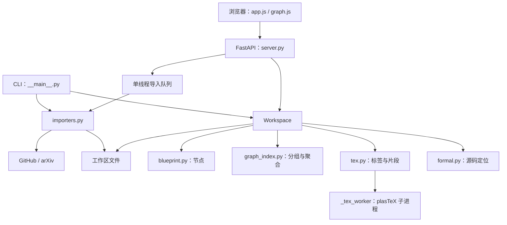

# Qprint 架构

[中文](ARCHITECTURE.md) | [English](ARCHITECTURE.en.md) · [文档目录](docs/index.md)

本文对应 `0.1.0` 及图谱分级扩展。Qprint 由本地 Python 服务、无构建步骤的浏览器前端和普通文件工作区组成，没有数据库。

## 系统结构

浏览器通过同源 API 获取数据；数学由本地 KaTeX 渲染。CLI 和 HTTP 入口共享 `Workspace` 与导入器，不维护两套业务规则。

## 模块边界

| 代码 | 职责 | 详细文档 |
| --- | --- | --- |
| `blueprint.py` | Node、元数据、节点链接、文本版本摘要 | [Blueprint](docs/blueprint.md) |
| `workspace.py`、`paths.py` | 扫描、索引、诊断、文件边界、保存与缓存 | [工作区](docs/workspace.md) |
| `graph_index.py`、`static/graph-view.js` | 文件/项目派生数据、颗粒度/范围/下钻状态 | [图谱](docs/graph.md) |
| `tex.py`、`_tex_worker.py` | 标签、章节、片段与受限渲染 | [TeX](docs/tex-rendering.md) |
| `formal.py` | 三语言声明定位与源码切片 | [形式化代码](docs/formal-code.md) |
| `server.py` | HTTP 契约、写入保护、后台任务 | [API](docs/server-api.md) |
| `static/app.js`、`graph.js`、HTML/CSS | 页面状态、阅读编辑、SVG 布局与交互 | [前端](docs/frontend.md) |
| `importers.py` | 限额下载、归档校验、暂存发布、来源记录 | [导入器](docs/importers.md) |
| `__main__.py`、`start.ps1`、`tools/` | 启动、检查、依赖资源和冒烟工具 | [开发](docs/development.md) |

## 数据所有权与标识

磁盘文件是事实来源。`Workspace` 扫描 `blueprint/**/*.md` 和 `tex/**/*.tex`，维护内存节点、边、论文目录、诊断、分级索引和渲染缓存；代码文件在读取节点详情时定位。

节点 ID 是 `相对路径（无 .md）#标题`，文件图 ID 是带 `.md` 的相对路径，项目图 ID 是目录路径，根目录使用 `.`。重命名文件或一级标题会改变节点 ID；当前没有永久 UUID、别名迁移或自动修复引用。

`/api/project` 的名称指整个工作区，返回的 `graph.projects` 指图谱项目分组。分组是只读派生数据，不能写回节点元数据。节点边来自 `uses` / `inspired_by`；粗粒度边来自文件引用，两者不应混用。

## 主要数据流

**加载与刷新：**扫描文件 → 解析节点和 TeX → 解析关系与标签绑定 → 建立论文内顺序 → 聚合文件/项目图。每次刷新完整重建，并清空渲染缓存；目前没有文件监听和增量索引。

**读取节点：**取节点 → 安全渲染 Markdown → 定位代码 → 按需渲染 TeX → 返回前后节点、依赖与反向引用。TeX 渲染结果按节点缓存至下次刷新。

**编辑保存：**读取原文和 SHA-256 → 客户端提交整份文本及原摘要 → 比较当前版本 → 校验解析结果和大小 → 同目录临时文件 → 再次检查版本 → `os.replace` → 重建索引。它是乐观冲突检测，不是对外部编辑器的操作系统文件锁。

**导入：**API 创建内存任务 → 单工作线程下载并校验 → 工作区内暂存 → 发布新目录/文件 → 刷新索引 → 客户端轮询结果。CLI 同步执行相同导入器；不经过 HTTP 任务队列。

## 并发与故障隔离

`Workspace` 使用进程内 `RLock` 保护索引操作，API 导入任务表使用独立锁。导入执行器只有一个工作线程，最多接受五个排队或运行中的任务。记录不持久化，也没有取消接口。

TeX 在独立 Python 子进程解析，8 秒超时或失败时返回转义后的原文。当前节点详情持有工作区锁，因此慢渲染仍可能延迟其他索引操作；子进程避免解析无限占用主进程，但不是完整的操作系统安全沙箱。

单节点解析错误形成诊断，不应让全部有效节点消失。导入先校验再发布且拒绝覆盖，论文 PDF 发布失败时尝试回退本次已发布的 TeX 目录；这不等于跨文件系统事务或崩溃恢复机制。

## 信任边界与技术选择

服务默认只绑定 `127.0.0.1`。Host 白名单、同源检查、会话写入 token 和内容安全策略用于本地浏览器边界；这些机制不是远程用户认证。路径工具校验相对路径与解析后的包含关系；导入器额外校验下载域、重定向、文件类型和资源限额。

采用普通 Markdown 保持用户编辑器兼容；采用 FastAPI 和原生 ES modules 减少运行组件；采用 plasTeX DOM 适配器与本地 KaTeX 分离结构解析和数学显示。SVG 图谱便于直接交互，但没有建立大数据量性能基线。

新增语言需同步元数据校验、代码定位、界面及测试；新增图谱层级应扩展派生索引和纯状态函数；新增网络来源需明确域名、归档规则、来源记录和失败清理。具体待办见 [TODO](TODO.md)。
