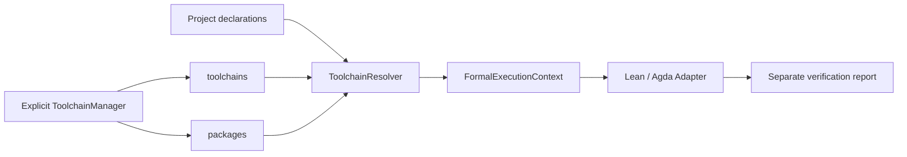

# Managed toolchains and formal packages

[中文](toolchains.md) | [English](toolchains.en.md) · [Documentation](index.en.md)

Qprint owns a versioned local toolchain store; code projects declare requirements. Reading never installs anything; GitHub post-download verification is enabled by default and can be disabled. Explicit verification acquires missing exact versions unless `--offline` is selected. See [modular project resolution](formal-resolution.en.md) for the separate parsing, acquisition, installation and reporting modules. Tests: [test_toolchains.py](../tests/test_toolchains.py), [test_formal_resolution.py](../tests/test_formal_resolution.py).

## Layout and ownership

```text
Qprint/
  qprint/toolchain-catalog.json       # tracked: exact URLs, platforms, hashes, layouts
  toolchains/                        # ignored: compilers, runtime data, receipts
    lean/4.19.0/bin/{lean,lake}.exe
    agda/2.8.0/bin/agda.exe
    agda/2.8.0/data/
  packages/                          # ignored: libraries, separate from compilers
    agda/cubical/<full-commit>/
  examples/verification/             # tracked, independently verifiable workspace
    blueprint/Identity.md
    lean/Identity/{lean-toolchain,lakefile.toml,Identity.lean}
    agda/Identity/{project.yaml,Identity.agda}
  release-manifest.json              # tracked: explicit distribution inputs
```

Git ignores `toolchains/`, `packages/`, `.lake/`, `_build/`, and `*.agdai`. Existing workspace `lean/`/`agda/` paths and binding semantics remain unchanged; user material is not moved into a new `formal/` directory. The compiler store belongs to the Qprint installation, not to Conda or an individual workspace, and can serve multiple workspaces.

Store home precedence: `--toolchain-home` (`--home` for manager commands), then `QPRINT_HOME`, then the parent of the Python `qprint` package. Source checkouts and this project's ZIP naturally use the Qprint root. Standalone pip installations should set `QPRINT_HOME` explicitly. Project declarations and receipts contain no machine paths; paths are resolved again after relocation. Global PATH, Conda packages, and user Agda library configuration are unchanged.

## Pinned installations

The initial catalog supports **Windows x64**: Lean **4.19.0**, Agda **2.8.0**, and Cubical **0.9**, commit `b150186d2544e7efeddd31e5d14a8b9ecbb100f7`. Other versions/platforms require reviewed catalog entries; there is no nearest-version selection.

```powershell
conda run -n qprint python -m qprint toolchain list
conda run -n qprint python -m qprint toolchain install lean-4.19.0-windows-x64
conda run -n qprint python -m qprint toolchain install agda-2.8.0-windows-x64
conda run -n qprint python -m qprint toolchain install cubical-0.9
```

Initial installation downloads fixed official HTTPS artifacts. An existing ZIP can be installed offline, with the same required SHA-256:

```powershell
conda run -n qprint python -m qprint toolchain install agda-2.8.0-windows-x64 --archive D:/downloads/Agda-v2.8.0-win64.zip
```

Downloads stream to disk, limited to 2 GiB; extraction allows at most 100,000 entries and 8 GiB expanded content. Paths, links, special files, case collisions, and reserved receipt filenames are validated before extraction. Staging, hash verification, compiler version checks, and Agda `--setup` precede atomic publication. Failure cleans staging. Matching installations are reused; unmanaged or mismatched directories are never overwritten.

Each `.qprint-install.json` records URL, archive hash, version, platform, and UTC installation time. Agda's hash was checked against the GitHub release digest. The older Lean release had no digest; its hash and the Cubical archive hash were calculated from the initial official HTTPS download and pinned for subsequent consistency checks. These are not independent signatures. Installed file contents are not fully rehashed on every verification; manual mutations are outside this guarantee.

Agda child-process `Agda_datadir` and `AGDA_DIR` point to its existing managed `data/` directory. The installer creates it before `--setup` to prevent fallback to the user profile. Compiler/library licenses are retained, including the bundled [Agda license](../qprint/toolchain-licenses/agda-2.8.0.txt).

Remove by exact catalog ID, for example `conda run -n qprint python -m qprint toolchain remove cubical-0.9`. Only the matching recorded installation is removed, after path/link checks. Projects and other versions remain. Stop dependent verification first; there is no reference counting or cancellation. A `.qprint/toolchain-manager.lock` serializes installation/removal; after a crash, confirm that no installer is active before manually clearing a leftover lock.

## Project declarations

Lean's native `lean-toolchain` is authoritative:

```text
leanprover/lean4:v4.19.0
```

Exact releases and release candidates are supported; floating `stable`/nightly pins are rejected. `project.yaml` cannot duplicate the Lean version. Lean libraries continue to use `lakefile.*` and `lake-manifest.json`; this implementation does not replace Lake dependency caches with shared `packages/lean` or automatically bundle arbitrary project `.lake` directories.

Agda uses `project.yaml` at the **code project's root**:

```yaml
schema_version: 1
formal:
  agda:
    version: "2.8.0"
    safe: inherit
    mode: cubical
    libraries:
      - name: cubical
        revision: b150186d2544e7efeddd31e5d14a8b9ecbb100f7
```

Versions must be exact strings. A library matches by name and either pinned version or full revision. Floating branches and global library selection are rejected. Explicit verification can acquire supported missing versions. `project.yaml` remains compatible; new projects prefer native configuration and `.qprint-formal.yaml`. `safe` and `mode` inherit workspace configuration when omitted, defaulting to inherit and standard. Modes are standard, cubical, and erased-cubical.

Source modules still declare native `OPTIONS`/`.agda-lib` settings. The example begins with `{-# OPTIONS --safe --cubical --guardedness #-}`. Manifest `mode` configures generated declaration probes; catalog entries supply necessary infective probe options such as guardedness. **Cubical mode is not passed globally to primitive modules**: that broke Agda 2.8.0's full/erased Cubical boundaries in real tests. Library options retain their native scope.

Without `qprint-verification.json`, Qprint discovers projects under `lean/`/`agda/` through `lean-toolchain`/`*.agda-lib`/`.qprint-formal.yaml`/`project.yaml`, stopping recursion at discovered roots and skipping caches, vendor directories, and links. With no declarations, a language directory remains a candidate, but execution reports a missing version. Explicit [verification configuration](formal-verification.en.md) replaces discovery and supports custom source roots and project boundaries.

## Resolution and execution



The context supplies exact executables, version, project/source roots, package paths, a controlled library registry, module options, and a child environment. Lean clears inherited toolchain overrides, uses absolute Lake/Lean paths, and prepends the selected bin directory to child PATH. Agda uses a temporary `--library-file` and `--no-default-libraries`, excluding user library lists. Native interfaces and OPTIONS are retained by default; explicit `safe: require` rechecks all interfaces, including primitives. Native parsing does not download; verification environment assembly can acquire exact artifacts without changing the parent environment.

Explicit verification first acquires supported missing versions. Offline resolution, unavailable exact artifacts and incomplete installations report errors. Only explicit `--allow-system-toolchains` permits PATH fallback, with compiler version checks and a matching Lake version for Lean. External Agda must already have its runtime data configured. System fallback is outside the managed bundle's portability guarantee.

```powershell
conda run -n qprint python -m qprint verify --workspace examples/verification
conda run -n qprint python -m qprint serve --workspace examples/verification --allow-verification
# Alternatively: ./start.ps1 -Workspace examples/verification -AllowVerification
```

Reports add `environment`: version, executables, origin, artifact IDs, library paths, and probe options. Environment secrets are not returned. Absolute paths belong only to the particular report. Author progress remains independent. Coq installation entries and its verification adapter remain unimplemented.

## Release packaging

[release-manifest.json](../release-manifest.json) explicitly lists source inputs and full-bundle artifact IDs, independently of `.gitignore`. The builder neither uses `git archive` nor copies the entire working directory.

```powershell
./scripts/build-release.ps1
./scripts/build-release.ps1 -Full
# Equivalent: conda run -n qprint python tools/build_release.py [--full]
```

Outputs are `dist/Qprint-0.1.0-windows-x64-light.zip` and `...-full.zip`, with a `Qprint/` root. Light contains code, docs, and the verification example. Full adds the listed Lean, Agda, Cubical, receipts, and licenses; missing items fail the build. Existing ZIPs are never overwritten. Git data, caches, imported user repositories, Agda interfaces, and Lake build directories are excluded. `release-info.json` records contents.

**These ZIPs do not bundle Python/Conda or a Python wheel dependency collection.** An existing `qprint` Python environment and dependencies are still required; standalone runtime packaging remains future work. Offline full-bundle verification means no additional formal compiler/example-library downloads after Python is available. When the navigation demo is absent, CLI and startup defaults select `examples/verification`.

Sources: [Lean 4.19.0](https://github.com/leanprover/lean4/releases/tag/v4.19.0), [Agda 2.8.0](https://github.com/agda/agda/releases/tag/v2.8.0), [Cubical compatibility](https://github.com/agda/cubical/tree/v0.9), and [Agda data-directory options](https://agda.readthedocs.io/en/v2.8.0/tools/command-line-options.html).
