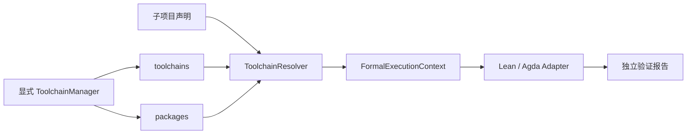

# 仓库内工具链与依赖库

[中文](toolchains.md) | [English](toolchains.en.md) · [文档目录](index.md)

Qprint 管理版本化的本地工具链存储；代码子项目只声明需要的环境。阅读不安装；GitHub 下载后验证默认开启，可按开关关闭；显式验证会自动补齐固定版本，`--offline` 禁止下载。解析、获取、安装及报告的职责见[模块化解析流程](formal-resolution.md)。测试：[test_toolchains.py](../tests/test_toolchains.py)、[test_formal_resolution.py](../tests/test_formal_resolution.py)。

## 目录及职责

```text
Qprint/
  qprint/toolchain-catalog.json       # 提交 Git：固定来源、平台、SHA-256、布局
  toolchains/                        # 忽略 Git：编译器、运行数据、安装记录
    lean/4.19.0/bin/{lean,lake}.exe
    agda/2.8.0/bin/agda.exe
    agda/2.8.0/data/                  # Agda 内置模块等运行数据
  packages/                          # 忽略 Git：形式化库，与编译器分开
    agda/cubical/<完整commit>/
  examples/verification/             # 提交 Git：可验证的独立示例工作区
    blueprint/Identity.md
    lean/Identity/{lean-toolchain,lakefile.toml,Identity.lean}
    agda/Identity/{project.yaml,Identity.agda}
  release-manifest.json              # 提交 Git：发行包输入清单
```

`toolchains/`、`packages/`、`.lake/`、`_build/` 和 `*.agdai` 均不提交 Git。现有工作区的 `lean/`、`agda/` 及绑定 `file` 语义保持不变，不将用户文件迁移到新的 `formal/` 目录。编译器存储属于 Qprint 安装目录，而不是某个工作区或 Conda 环境。多个工作区可共享它。

存储根目录优先级：CLI 的 `--toolchain-home`（manager 用 `--home`）→ `QPRINT_HOME` → `qprint` 包所在目录的上一级。源码运行及本项目 ZIP 均默认得到 Qprint 根目录；单独 pip 安装到其他位置时应显式指定 `QPRINT_HOME`。所有路径在解析时重新计算，项目声明和安装记录不保存机器绝对路径。不修改系统/用户 PATH、Conda 包或用户 Agda 库配置。

## 已固定的环境与安装

首批目录项针对 **Windows x64**：Lean **4.19.0**、Agda **2.8.0**、Cubical **0.9**（提交 `b150186d2544e7efeddd31e5d14a8b9ecbb100f7`）。其他平台或版本不会自动选择“最近”版本，须先增加经校验的目录项。

```powershell
.\.conda\python.exe -m qprint toolchain list
.\.conda\python.exe -m qprint toolchain install lean-4.19.0-windows-x64
.\.conda\python.exe -m qprint toolchain install agda-2.8.0-windows-x64
.\.conda\python.exe -m qprint toolchain install cubical-0.9
```

首次安装会访问目录项固定的官方 HTTPS 地址；需网络。已下载的归档可离线安装：

```powershell
.\.conda\python.exe -m qprint toolchain install agda-2.8.0-windows-x64 --archive downloads/Agda-v2.8.0-win64.zip
```

`--archive` 也必须匹配固定 SHA-256。下载以流方式写入磁盘，最多 2 GiB；ZIP 最多 100,000 项、总解压 8 GiB，拒绝路径逃逸、链接、特殊文件、重复大小写路径和保留安装记录名。校验和解压在暂存目录完成；工具链执行版本检查，Agda 额外执行 `--setup`，成功后原子发布。失败清理暂存；既有匹配安装直接复用，未经管理或记录不符的目录拒绝覆盖。

每项存储 `.qprint-install.json`，记录来源 URL、归档哈希、版本、平台和 UTC 安装时间。Agda 哈希与 GitHub release 提供的 digest 比对；Lean 旧 release 未提供 digest，其哈希及 Cubical 归档哈希由本次官方 HTTPS 下载计算并固定在目录中。它们是后续下载的一致性校验值，不是独立签名。安装后不会每次遍历校验所有文件；用户手动修改安装内容不在该保证之内。

Agda 的 `Agda_datadir` 和 `AGDA_DIR` 在子进程内指向现有的托管 `data/`。安装时先创建此目录，再执行 `--setup`，防止工具回退到用户目录。保留编译器/库许可证；Agda 许可证位于 [toolchain-licenses](../qprint/toolchain-licenses/agda-2.8.0.txt)。

删除使用同一目录项 ID：`.\.conda\python.exe -m qprint toolchain remove cubical-0.9`。只删除带匹配记录的精确安装目录，检查最终路径和链接，不自动删除其使用项目或其他版本。先停止正在使用它的验证；没有引用计数或运行任务取消。安装/删除通过 `.qprint/toolchain-manager.lock` 串行化；崩溃遗留锁需确认无安装进程后手动清理。

## 子项目只声明需求

Lean 使用生态原生的 `lean-toolchain`，例如：

```text
leanprover/lean4:v4.19.0
```

只接受固定发布版本（含 rc），拒绝 `stable`、浮动 nightly 等。`project.yaml` 不能重复声明 Lean 版本。库依赖继续由项目的 `lakefile.*` / `lake-manifest.json` 管理；本批实现没有把 Lake 的依赖缓存改造成共享 `packages/lean`，也不会将任意项目的 `.lake` 自动加入 Release。

Agda 在**代码子项目根目录**放 `project.yaml`：

```yaml
schema_version: 1
formal:
  agda:
    version: "2.8.0"
    safe: inherit
    mode: cubical
    libraries:
      - name: cubical
        revision: b150186d2544e7efeddd31e5d14a8b9ecbb100f7
```

`version` 必须是完整字符串。每个库以 `name` 加 `version` 或完整 `revision` 匹配目录项；不接受浮动分支或选择全局库。验证可自动下载支持的固定版本。此处 `project.yaml` 是兼容格式；新项目优先采用原生配置与 `.qprint-formal.yaml`，见[解析规则](formal-resolution.md)。`safe` 默认沿用工作区配置（默认 inherit）；`mode` 同理，允许 standard/cubical/erased-cubical。

源码本身仍使用原生 `OPTIONS` 或 `.agda-lib` 声明模块选项。例如示例文件首行是 `{-# OPTIONS --safe --cubical --guardedness #-}`。Qprint 的 `mode` 配置声明探针的模块选项；库的感染性选项（如 guardedness）由固定目录项传给探针。**不把 `--cubical` 全局传给所有内置模块**：实测这会破坏 Agda 2.8.0 的 full/erased Cubical 边界。库自有 `.agda-lib` 选项保留作用域。

没有 `qprint-verification.json` 时，扫描 `lean/`、`agda/` 下的 `lean-toolchain` / `project.yaml` 识别子项目；找到项目后不再递归其子目录，并跳过缓存、vendor 和链接。未发现声明时仍把语言目录作为候选项目，但执行验证会返回缺少版本。自定义 `source_root` 或特殊项目边界继续通过[验证配置](formal-verification.md)指定；该文件存在时替代自动发现。

## Resolver 与适配器



`FormalExecutionContext` 包含精确编译器/驱动路径、版本、项目/源码根、库路径、受控库清单、模块选项和子进程环境。Lean 清除继承的错误工具链路径，使用绝对 Lake/Lean 路径并在子进程 PATH 前置所选 bin。Agda 使用临时 `--library-file`、`--no-default-libraries`，不读取用户全局库列表；默认保留上游接口和 OPTIONS；显式 `safe: require` 时重新检查全部接口（含内置模块）。原生解析器不下载；执行环境层在验证时按需安装，不修改父进程环境。

显式验证先尝试补齐支持的缺失版本；离线模式、无法取得精确版本或安装不完整时报告错误。只有显式 `--allow-system-toolchains` 才允许尝试 PATH 编译器，且运行版本检查，Lean 还检查 Lake 匹配版本；Agda 的系统回退要求该外部安装本身已配置运行数据。该模式不属于离线托管包的可移植性保证。

```powershell
.\.conda\python.exe -m qprint verify --workspace examples/verification
.\.conda\python.exe -m qprint serve --workspace examples/verification --allow-verification
# 也可用 ./start.ps1 -Workspace examples/verification -AllowVerification
```

报告新增 `environment`：版本、编译器、驱动、来源、目录项 ID、库路径与探针选项；不返回环境变量秘密。机器路径仅出现在当次报告中。作者 `status` 与验证结果继续独立。Coq 仍未实现安装目录项及验证适配器。

## Release 打包

[release-manifest.json](../release-manifest.json) 明确列出源代码输入及 full 包需要的目录项，与 `.gitignore` 无关。打包器不使用 `git archive`，也不枚举整个工作目录。

```powershell
./scripts/build-release.ps1
./scripts/build-release.ps1 -Full
# 对应：.\.conda\python.exe tools/build_release.py [--full]
```

输出 `dist/Qprint-0.1.0-windows-x64-light.zip` 或 `...-full.zip`，内部根目录为 `Qprint/`。light 包含程序、文档和独立验证示例；full 额外包含清单指定的 Lean、Agda、Cubical 和安装记录/许可证。full 缺任何一项会失败，不生成冒充完整的包。不覆盖已有 ZIP。排除 Git、缓存、用户导入仓库、Agda 接口和 Lake 构建目录；包含 `release-info.json` 说明内容。

**当前 ZIP 不包含 Python/Conda 运行时或 Python wheel 依赖集合。** 包内包含 `environment.yml`；首次解压后在 Qprint 根目录运行 `conda env create -p .\.conda -f environment.yml` 创建本地环境。`.conda` 不随 ZIP 分发；Python 冻结/独立运行时是后续工作。本次 full 的离线验证指：已有 Python 环境后，无需联网安装形式化编译器/示例依赖。默认 demo 不在发行包时，CLI 和启动脚本使用 `examples/verification`。

版本来源：[Lean 4.19.0](https://github.com/leanprover/lean4/releases/tag/v4.19.0)、[Agda 2.8.0](https://github.com/agda/agda/releases/tag/v2.8.0)、[Cubical 0.9 兼容表](https://github.com/agda/cubical/tree/v0.9)、[Agda 运行数据选项](https://agda.readthedocs.io/en/v2.8.0/tools/command-line-options.html)。
